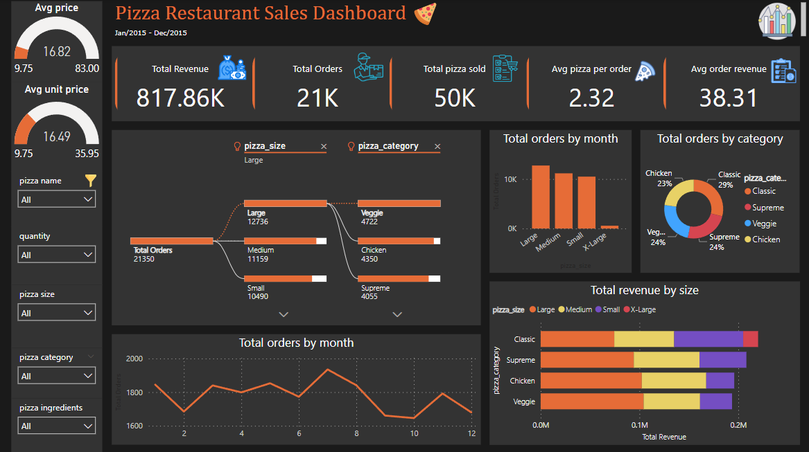
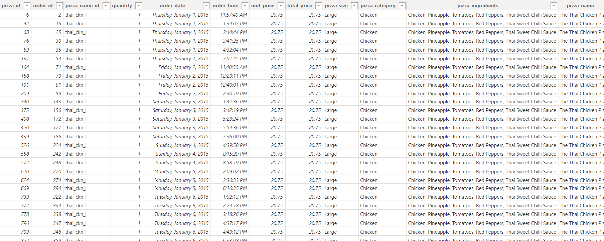
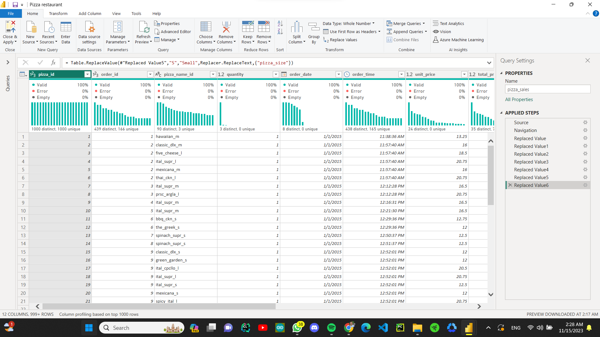

# Pizza-restaurant-analysis
Pizza restaurant analysis using Power BI + Power Query

# Table of Contents
1.**Introduction**
1.**Overview Dashboard**
3.**Dataset**
4.**SQL**
5.**Power Query**
6.**Usage**

# Intoduction
The project aims to analyze the 'Pizza restaurant' dataset to derive insights and facilitate data-driven decision-making for anyone interested in data analysis and dashboards.

# Overview Dashboard

**Process of the project**

This project involves leveraging SQL to extract Key Performance Indicators (KPIs) as per the client's requirements. The data is extracted from an MS SQL-connected database and seamlessly integrated into Power BI. Subsequently, Power Query is employed to perform a thorough data transformation, involving tasks such as eliminating unnecessary columns, renaming fields, and executing additional data cleansing processes. The final step entails crafting an insightful dashboard using Power BI, thereby presenting the refined data in a visually compelling manner for effective analysis.

# Dataset

The dataset contains the following columns:

-pizza_id

-order_id

-quantity

-order_date

-order_time

-unit_price

-total_price

-pizza_size

-pizza_category

-pizza_ingredients

-pizza_name

-Order Month

# SQL
**SQl queries**
the sql queris contains a 11 type of queries:
1. KPI's
2. Daily Trend for Total Orders
3. Monthly Trend for Orders
4. % of Sales by Pizza Category
5. % of Sales by Pizza Size
6. Total Pizzas Sold by Pizza Category
7. Top 5 Pizzas by Revenue
8. Bottom 5 Pizzas by Revenue
9. Top 5 Pizzas by Quantity
10. Bottom 5 Pizzas by Quantity

to view the SQL queries click [Here](./PIZZA SALES SQL QUERIES.docx)

# Power Query

I used Power Query to clean and preprocess my data before visualizing it, following a series of steps:
1. Eliminate unnecessary columns from the dataset.
2. Designate the initial row as column headers for better organization.
3. Rename the columns to enhance clarity and understanding.
4. Adjust data types to ensure consistency and compatibility.
5. Substitute specific values to refine and standardize the data.

# Usage
to acces the Dashboard [Click Here](Pizza restaurant.pbix)
to access the Dataset [Click Here](pizza_sales_excel_file (1).xlsx)

